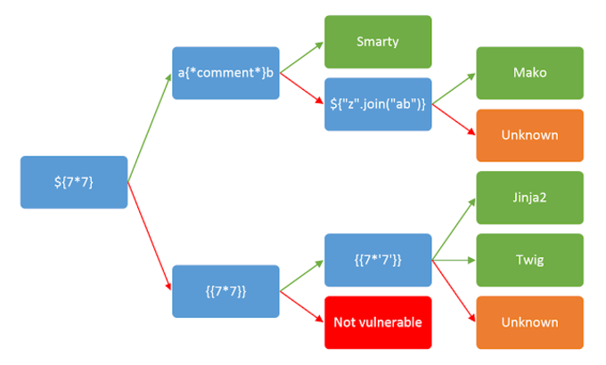
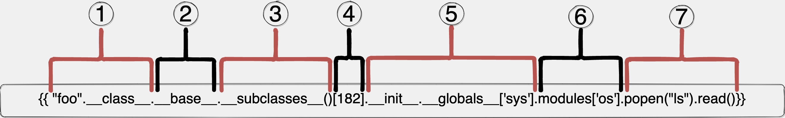

# bc_python_flask_form
BeCode Python - Flask Form Module

## Project

### Length

- 1 day to learn about flask
- 4 days to develop the project

### Skills

- Backend: Python Programming (initiation to logical structures)
- Validation and Sanitazation of a form
- Implementing POST and GET requests
- Implementing templates with Jinja

### Situation

The company "Hackers Poulette" is selling DIY kits and accessories for Raspberry Pi's, they want to implement a form for technical support.

Your mission is to develop a python script, showing a contact form and handling its use (sanitazation, validation, submit and feedback)

## Rules

### Performance criteria

- If there is an error in the user input, return the form with valid fields still filled.
- Show the field errors near the field in question.
- The form should sanitize and have server side validation.
- If the sanitazation and validation are ok, a "Thank you for your message" page should show with a run-down of all the information the user input.
- Implement antispam and honeypots
- **Required fields**:
    - Full name
    - Email
    - Country (list)
    - Message
    - Gender (radio box)
    - Subject (Repair, Order, Other)
- All fields are required except "Subject", which will default to "Other" value if not entered


### Goals

- Presentation: architechture client/server
- Sanitazation: neutralize all malicious code (script tags)
- Validation: required fields + valid email
- Confirmation: feedback when message sent
- NO JS OR CSS


### End goals

At the end of the project, the following skills should be acquired:

- Explain the difference betwenn a POST and GET request
- Avoid XSS attacks
- Avoid SSTI attacks
- Use a micro framework
- Deploy an app


## Running the project

Navigate to the desired version (v1 or v2)

v1 is a barebones simple form with minimal features

v2 is integrated with WTForms

```sh
flask run
```

Navigate to the url the terminal gives you (localhost:5000), you can see an example message already displayed.

Navigate to "Create" and create a message.


## Presentation

### Group

Our group consists of myself, [Gokhan](#), [Gustavo](#) and [Mitu](#).

### Subject

We were tasked with the presentation of the SSTI aspect of the project.

### SSTI

Server Side Template Injection, or SSTI is a <ins>template injection attack</ins>.

Templates are files a server uses to render an HTML page and populate it with dynamic data.

Injection attacks are a type of attacks that inject malicious code into your page, usually via form fields and/or urls.

### Detection Phase

As with most attacks, the first step is to figure out wether the target page is vulnerable, for this we will try to inject some logic operations into a field.

Let's use a string that tests most of the common templates, called a polyglot payload.

```${{<%[%'"}}%\.```

If the next step in the form returns an error or raises an exception, the app is vulnerable.

### Identification Phase

Next we need to identify what back-end is running, for this we can decompose the polyglot statement and start injecting specific server language payloads.



After you've identified the backend running on the target, you can start documenting yourself on the possible sandbox-escaping mechanisms and enter the exploitation phase.

### Exploitation Phase
Since the project is in Jinja2, we will take it as an example.

Python being an Object Oriented Programming language, it gives us access to some built-in methods that we could use to exploit the system, such as `__init__`

If we execute this snippet;

```sh
{{ "hello".__class__.__base__.__subclasses__()[182].__init__.__globals__['sys'].modules['os'].popen("ls").read()}}
```
it will run `ls` on the servers filesystem.

To explain what's happening;



1. Returns the class for the "hello" string, which givse us `<class 'str'>`
2. Returns the base class (parent class that the 'str' class inherits from), it outputs `<class 'object'>`
3. Returns all the child classes inheriting from the 'object' class, which is a list `[<class 'type'>, <class 'weakref'>, ....etc`
4. Returns the class that is located at the index 182, being `<class 'warnings.catch_warnings'>`. We chose this class because it imports the 'sys' module, and from that we can reach the 'os' module.
5. The `__init__` constructor is called and then `__globals__` which returns a dictionary that hold the functions global variables, in this case we need them only for the 'sys' module. Output is `<module 'sys' (built-in)>`
6. 'sys' has many modules built-in, we are only interested in the 'os' one. Outputs `<module 'os' from '/Library/Frameworks/Python.framework/Versions/3.7/lib/python3.7/os.py'>`
7. Any method in the 'os' module can now be invoked, we'll execule `ls` using [popen](https://docs.python.org/3/library/os.html#os.popen) and read the output.

### tplmap
A tool called [tplmap](https://github.com/epinna/tplmap) can be used to help with SSTI attacks.

Once installed, simply run:
```sh
python tplmap.py -u "http://127.0.0.1:5000/?name" --os-shell
```

### Prevention

As for prevention, it's quite straight forward since the attack relies only on your server not being set up proprely and/or accepting dangerous inputs.

<ins>Sanitization</ins>: Input sanitization is a cybersecurity measure of checking, cleaning, and filtering data inputs from users, APIs, and web services of any unwanted characters and strings to prevent the injection of harmful codes into the system.

Flask configures Jinja2 to sanitize output by default.

If your app is required to deal with risky characters (Text editor app, etc...), it is recommended to also Sandbox your environment.

<ins>Sandboxing</ins>: A sandbox is an isolated testing environment that enables users to run programs or open files without affecting the application, system or platform on which they run. 


## Ressources

[Install Flask](https://flask.palletsprojects.com/en/2.3.x/installation/)

[Web Forms in Flask](https://www.digitalocean.com/community/tutorials/how-to-use-web-forms-in-a-flask-application)

[WTForms](https://www.digitalocean.com/community/tutorials/how-to-use-and-validate-web-forms-with-flask-wtf)

[Flask](https://flask.palletsprojects.com/en/2.3.x/)

[Jinja](https://jinja.palletsprojects.com/en/3.1.x/)

[Pentester's Guide to Server Side Template Injections](https://www.cobalt.io/blog/a-pentesters-guide-to-server-side-template-injection-ssti)

[Secure Cookie's SSTI writeup](https://secure-cookie.io/attacks/ssti/)

[Secure Cookie's web lab](https://ssti.secure-cookie.io/)

[HackTricks SSTI](https://book.hacktricks.xyz/pentesting-web/ssti-server-side-template-injection)